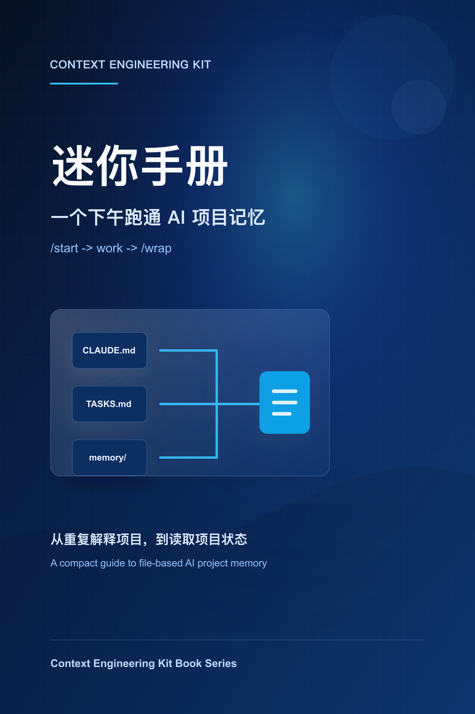
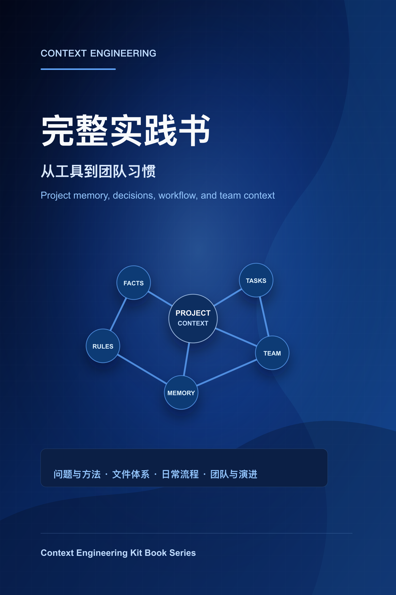

# Context Engineering Kit

把 AI 编程里的项目背景、任务、决策和每日状态外置到文件中，减少每次新会话都要重新解释项目的成本。

这不是一个重型框架，而是一套轻量的 Context Engineering 实践包：确定性安装、可读模板、少量安全升级能力和基本健康检查。适用于 Claude Code，核心思想可迁移到 Codex、Cursor、Windsurf 等 AI 编程工具。

适合你，如果你经常遇到：
- AI 新会话忘记项目背景、架构和当前进度
- 同一个技术决策反复解释，AI 又建议已被否定的方案
- 长期项目里任务、bug、实验和经验散落在聊天记录里
- 想给个人项目或小团队建立一套低成本的 AI 协作习惯

## 开始了解

<p>
  
  
</p>

- [迷你手册](docs/book/variant-1-mini-handbook.md) — 用一个下午跑通 AI 项目记忆。
- [完整实践书](docs/book/variant-3-complete-book.md) — 从工具到团队习惯的 15 章完整路径。
- [Launch Post 草稿](docs/launch-post.md) — 对外发布时可直接改写使用。
- [Demo 脚本](docs/demo.md) — 展示安装前后、`/start`、`/wrap` 和 team mode 的差异。

## 30 秒快速开始

```bash
# Solo 模式（默认）
/path/to/context-engineering-kit/install.sh
# 或指定目标项目
/path/to/context-engineering-kit/install.sh /path/to/your-project

# 团队模式
/path/to/context-engineering-kit/install.sh --team --user alice
```

然后进入 Claude Code，在目标项目中运行：

```text
/init-context
```

初始化完成后的推荐项目结构：

```
your-project/
├── README.md              ← 项目入口文档
├── CLAUDE.md              ← AI 项目说明书
├── AGENTS.md              ← 通用 Agent 工作规则
├── ARCHITECTURE.md        ← 架构说明
├── TASKS.md               ← 任务追踪
├── DECISIONS.md           ← 决策日志
├── memory/                ← 短期状态（AI 维护）
│   ├── current_state.md
│   ├── bugs.md
│   ├── experiments.md
│   ├── lessons_learned.md
│   └── daily_log.md
├── prompts/               ← 编码规范（人工定义）
│   ├── common/
│   ├── typescript/
│   ├── python/
│   └── backend/
├── .claude/commands/      ← Claude Code 命令
│   ├── init-context.md
│   ├── start.md
│   └── wrap.md
└── src/                   ← 你的源代码
```

`install.sh` 只安装命令和基础模板，不分析项目代码；`/init-context` 会读取现有项目，生成或补齐 `CLAUDE.md`、`ARCHITECTURE.md`、README 等项目专属上下文文件。若项目里已经有 `CLAUDE.md`，`/init-context` 会读取并补充缺失信息，不覆盖已有内容。

完整操作手册见 [docs/usage-guide.md](docs/usage-guide.md)。

## Demo

安装后会先得到确定性的基础结构：

```text
.claude/commands/
├── init-context.md
├── start.md
└── wrap.md

memory/
├── current_state.md
├── bugs.md
├── experiments.md
├── lessons_learned.md
└── daily_log.md

prompts/
├── common/
├── typescript/
├── python/
└── backend/
```

然后在 Claude Code 中运行 `/init-context`，AI 会读取当前项目，生成或补齐 `CLAUDE.md`、`ARCHITECTURE.md`、`TASKS.md`、`DECISIONS.md` 等项目专属上下文。之后每天用 `/start` 恢复上下文，用 `/wrap` 写回当天状态。

## 三个核心命令

| 命令 | 何时用 | 作用 |
|------|--------|------|
| `/init-context` | 新项目首次 | 分析项目 → 创建/补齐上下文文件 → 生成项目专属文档 |
| `/start` | 每天开始工作 | 读文档 + git 状态 → 恢复上下文 → 等待指令 |
| `/wrap` | 每天结束工作 | 总结今天 → 更新 memory → 写日志 |

## 团队模式

使用 `--team --user <name>` 安装后，目录结构变为：

```
project/
├── CLAUDE.md, AGENTS.md, ARCHITECTURE.md  # 共享（git tracked）
├── DECISIONS.md                            # 共享，追加写入
├── TASKS.md                                # 共享
├── prompts/                                # 共享
├── memory/
│   ├── TEAM.md                # 共享 — 谁在做什么
│   ├── shared/                # 共享 — 团队整体状态
│   │   ├── current_state.md
│   │   └── bugs.md
│   └── {username}/            # 个人（gitignored）
│       ├── current_state.md
│       ├── daily_log.md
│       └── ...
└── .cek                       # kit 元数据
```

关键设计：
- **个人 memory** 被 `.gitignore` 排除，不会 merge 冲突
- **`memory/TEAM.md`** 是团队成员状态表，`/start` 展示谁在做什么，`/wrap` 更新自己的行
- **`.gitattributes`** 对 `DECISIONS.md` 等 append-only 文件设置 `merge=union`，减少冲突
- 模板可自定义：`commands/`、`memory/`、`prompts/` 都可以按团队需求调整

## 升级

```bash
# 对比目标项目安装版本与当前本地 kit 版本
/path/to/context-engineering-kit/doctor.sh /path/to/your-project

# 升级（覆盖 commands，不覆盖项目文件）
/path/to/context-engineering-kit/upgrade.sh /path/to/your-project
```

升级策略：
- `.claude/commands/` — **覆盖**（用户很少改命令模板）
- 根级模板、`prompts/` — **跳过**（可能已自定义）
- `memory/` — **跳过已有文件，只创建新增模板**
- 新增文件 — **创建**（kit 新版本引入的新模板）
- `.cek` — **更新版本号**

## 健康检查

```bash
/path/to/context-engineering-kit/doctor.sh /path/to/your-project
```

`doctor.sh` 会检查必要文件、Claude Code 命令、`AGENTS.md`、占位内容、当前模式对应的 `memory/*/current_state.md` 更新时间、`DECISIONS.md` 重复编号、kit 版本和团队模式配置。刚安装但尚未运行 `/init-context` 时，缺少 `CLAUDE.md` 会作为初始化提示输出，不会导致检查失败。

## 跨工具适配

| 工具 | 入口/规则 |
|------|-----------|
| Claude Code | `CLAUDE.md` + `.claude/commands/` |
| Codex | `AGENTS.md` / repo instructions |
| Cursor | `.cursor/rules` |
| Windsurf | rules 文件 |

详细说明见 [docs/tooling-guide.md](docs/tooling-guide.md)。

## 反馈重点

如果你在真实项目中试用，最有价值的反馈是：
- `/init-context` 生成的上下文是否真的有用
- `/start` 是否减少了恢复项目状态的时间
- `/wrap` 是否愿意每天使用，还是太重
- 哪些模板太复杂、太空泛或缺少关键字段
- solo/team 模式是否符合你的工作方式

建议 GitHub topics：`ai-coding`、`claude-code`、`context-engineering`、`developer-tools`、`prompt-engineering`。

## 每日工作流

```
/start → 编码工作 → /wrap
 ↑                    │
 └────────────────────┘  (循环)
```

1. `/start` — AI 读取项目文档和状态，30 秒恢复上下文
2. 编码工作 — 小步 git commit，决策追加 DECISIONS.md
3. `/wrap` — AI 自动更新 memory 文件，为下次会话做准备

## Kit 目录说明

```
context-engineering-kit/
├── install.sh           安装脚本（支持 --team --user）
├── upgrade.sh           升级脚本
├── doctor.sh            健康检查脚本
├── VERSION              版本号
├── CHANGELOG.md         变更日志
├── README.md            本文件
├── commands/            Claude Code 命令模板
│   ├── init-context.md  项目初始化
│   ├── start.md         恢复上下文
│   └── wrap.md          下班总结
├── templates/           纯空模板（不含项目内容）
│   ├── AGENTS.md
│   ├── TASKS.md
│   ├── DECISIONS.md
│   ├── memory/
│   ├── prompts/
│   └── team/            团队模式模板
│       ├── TEAM.md
│       ├── gitignore.append
│       └── gitattributes
└── docs/
    ├── usage-guide.md               使用指南
    ├── context-engineering-guide.md  完整开发指南
    ├── tooling-guide.md              跨工具适配指南
    └── release-guide.md              发布检查清单
```

## 核心理念

> 真正高级的 AI 编程，不是"怎么提问"，而是"怎么管理上下文"。

- **状态外置化**：项目状态写入文件，不依赖 AI 记忆
- **文档驱动**：AI 每次通过文件恢复上下文，不靠对话历史
- **小步提交**：Git 记录演化历史，AI 可读可回溯
- **决策留痕**：记录"为什么"而不只是"做了什么"，防止 AI 推翻已定方案

详细指南见 [docs/context-engineering-guide.md](docs/context-engineering-guide.md)。

---

# Context Engineering Kit (English)

Externalize project background, tasks, decisions, and daily state into files so AI coding sessions do not start from zero every time.

This is not a heavy framework. It is a lightweight Context Engineering practice kit: deterministic install, readable templates, a small safe-upgrade path, and basic health checks. Built for Claude Code, with core concepts portable to Codex, Cursor, Windsurf, and other AI coding tools.

Use it if you often run into:
- New AI sessions forgetting project background, architecture, and current progress
- Re-explaining the same technical decisions while AI suggests rejected options again
- Tasks, bugs, experiments, and lessons scattered across chat history
- A need for a low-cost AI collaboration habit for personal projects or small teams

## 30-Second Quick Start

```bash
# Solo mode (default)
/path/to/context-engineering-kit/install.sh
# Or specify target project
/path/to/context-engineering-kit/install.sh /path/to/your-project

# Team mode
/path/to/context-engineering-kit/install.sh --team --user alice
```

Then open Claude Code in the target project and run:

```text
/init-context
```

After initialization, the recommended project structure:

```
your-project/
├── README.md              ← Project overview
├── CLAUDE.md              ← AI project handbook (read every session)
├── AGENTS.md              ← Universal agent working rules
├── ARCHITECTURE.md        ← System architecture
├── TASKS.md               ← Task tracking
├── DECISIONS.md           ← Decision log (why + what was rejected)
├── memory/                ← Short-term state (AI-maintained)
│   ├── current_state.md
│   ├── bugs.md
│   ├── experiments.md
│   ├── lessons_learned.md
│   └── daily_log.md
├── prompts/               ← Coding standards (human-defined)
│   ├── common/
│   ├── typescript/
│   ├── python/
│   └── backend/
├── .claude/commands/      ← Claude Code slash commands
│   ├── init-context.md
│   ├── start.md
│   └── wrap.md
└── src/                   ← Your source code
```

`install.sh` only copies commands and templates without analyzing code. `/init-context` reads the project and generates project-specific files like `CLAUDE.md`, `ARCHITECTURE.md`, etc. If `CLAUDE.md` already exists, it preserves the original content and only adds missing context.

Full guide: [docs/usage-guide.md](docs/usage-guide.md).

## Demo

After installation, you first get a deterministic base structure:

```text
.claude/commands/
├── init-context.md
├── start.md
└── wrap.md

memory/
├── current_state.md
├── bugs.md
├── experiments.md
├── lessons_learned.md
└── daily_log.md

prompts/
├── common/
├── typescript/
├── python/
└── backend/
```

Then run `/init-context` in Claude Code. The AI reads the current project and creates or supplements project-specific context such as `CLAUDE.md`, `ARCHITECTURE.md`, `TASKS.md`, and `DECISIONS.md`. After that, use `/start` to restore context and `/wrap` to write back the day's state.

## Three Core Commands

| Command | When | What it does |
|---------|------|--------------|
| `/init-context` | First time on a new project | Analyzes code → creates/supplements context files |
| `/start` | Start of each work session | Reads docs + git status → restores context in ~30s |
| `/wrap` | End of each work session | Summarizes today → updates memory files → writes daily log |

## Team Mode

Install with `--team --user <name>` to enable team collaboration:

```
project/
├── CLAUDE.md, AGENTS.md, ARCHITECTURE.md  # Shared (git tracked)
├── DECISIONS.md                            # Shared, append-only
├── TASKS.md                                # Shared
├── prompts/                                # Shared
├── memory/
│   ├── TEAM.md                # Shared — who's working on what
│   ├── shared/                # Shared — team-wide state
│   │   ├── current_state.md
│   │   └── bugs.md
│   └── {username}/            # Personal (gitignored)
│       ├── current_state.md
│       ├── daily_log.md
│       └── ...
└── .cek                       # Kit metadata
```

Key design:
- **Personal memory** is gitignored — no merge conflicts
- **`memory/TEAM.md`** tracks who's working on what; `/start` shows team context, `/wrap` updates your row
- **`.gitattributes`** sets `merge=union` for append-only files like `DECISIONS.md`
- All templates are customizable — adapt commands, memory formats, and prompts to your needs

## Upgrade

```bash
# Compare the target project's installed version with the current local kit
/path/to/context-engineering-kit/doctor.sh /path/to/your-project

# Upgrade (overwrites commands, preserves project files)
/path/to/context-engineering-kit/upgrade.sh /path/to/your-project
```

Upgrade policy:
- `.claude/commands/` — **overwrite** (rarely edited by users)
- Root templates and `prompts/` — **skip** (may be customized)
- `memory/` — **skip existing files, create new templates only**
- New files — **create** (templates introduced in new versions)
- `.cek` — **update version** (preserves mode, user, etc.)

## Health Check

```bash
/path/to/context-engineering-kit/doctor.sh /path/to/your-project
```

Checks: required files, Claude Code commands, `AGENTS.md`, placeholder content, mode-specific `memory/*/current_state.md` freshness, `DECISIONS.md` duplicate IDs, kit version, and team mode config. If the project was installed but `/init-context` has not run yet, missing `CLAUDE.md` is reported as an initialization warning rather than a failure.

## Cross-Tool Compatibility

| Tool | Entry point |
|------|-------------|
| Claude Code | `CLAUDE.md` + `.claude/commands/` |
| Codex | `AGENTS.md` / repo instructions |
| Cursor | `.cursor/rules` |
| Windsurf | rules file |

Details: [docs/tooling-guide.md](docs/tooling-guide.md).

## Feedback Focus

If you try this on a real project, the most useful feedback is:
- Whether `/init-context` generated useful context
- Whether `/start` actually reduced context recovery time
- Whether `/wrap` is light enough for daily use
- Which templates feel too heavy, too vague, or missing key fields
- Whether solo/team mode matches your workflow

Suggested GitHub topics: `ai-coding`, `claude-code`, `context-engineering`, `developer-tools`, `prompt-engineering`.

## Daily Workflow

```
/start → coding work → /wrap
 ↑                       │
 └───────────────────────┘  (loop)
```

1. `/start` — AI reads project docs and state, restores context in ~30s
2. Coding — small git commits, record decisions in DECISIONS.md
3. `/wrap` — AI updates memory files, prepares for next session

## Kit Directory

```
context-engineering-kit/
├── install.sh           Installer (supports --team --user)
├── upgrade.sh           Upgrade script
├── doctor.sh            Health checker
├── VERSION              Version number
├── CHANGELOG.md         Changelog
├── README.md            This file
├── commands/            Claude Code command templates
│   ├── init-context.md
│   ├── start.md
│   └── wrap.md
├── templates/           Empty templates (no project content)
│   ├── AGENTS.md
│   ├── TASKS.md
│   ├── DECISIONS.md
│   ├── memory/
│   ├── prompts/
│   └── team/            Team mode templates
│       ├── TEAM.md
│       ├── gitignore.append
│       └── gitattributes
└── docs/
    ├── usage-guide.md               Usage guide
    ├── context-engineering-guide.md  Full development guide
    ├── tooling-guide.md              Cross-tool adaptation guide
    └── release-guide.md              Release checklist
```

## Core Philosophy

> The real leap in AI-assisted programming isn't "how to prompt" — it's "how to manage context."

- **Externalized state**: Write project state to files, don't rely on AI memory
- **Document-driven**: AI restores context from files every session, not chat history
- **Small commits**: Git records evolution history, AI can read and trace back
- **Decision trail**: Record "why" and "what was rejected", prevent AI from revisiting decided topics

Full guide: [docs/context-engineering-guide.md](docs/context-engineering-guide.md).
